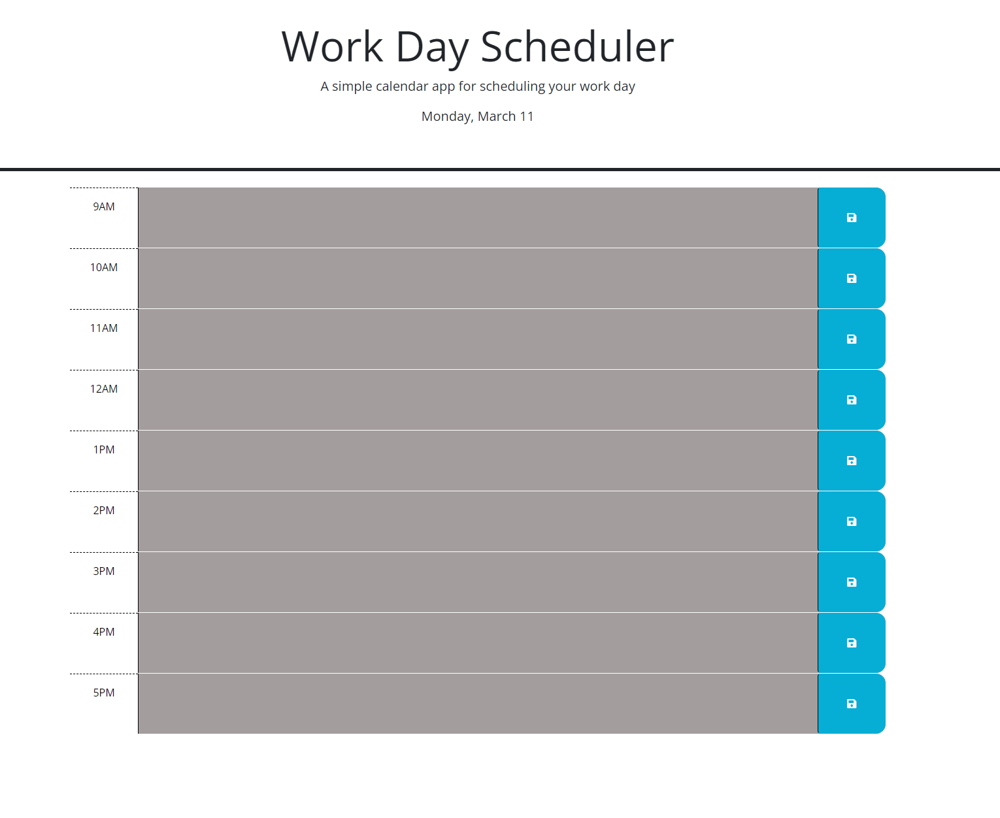

## Description
This week we were tasked to make a daily planning schedule which shows colors based on past present or future, it also has to be able to save notes to local storage. When the page is refreshed the notes are supposed to stay in place. This was a fun assignment working through drafts of code. 

## Site Link
https://mikef13x.github.io/work-day-planner/

## Screenshot 

## Notes
I worked with a tutor for part of the JavaScript, I also worked with my wife Kayla Freeman who is in the same course as me. 